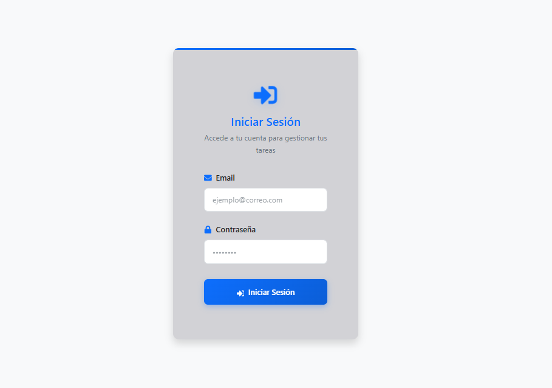
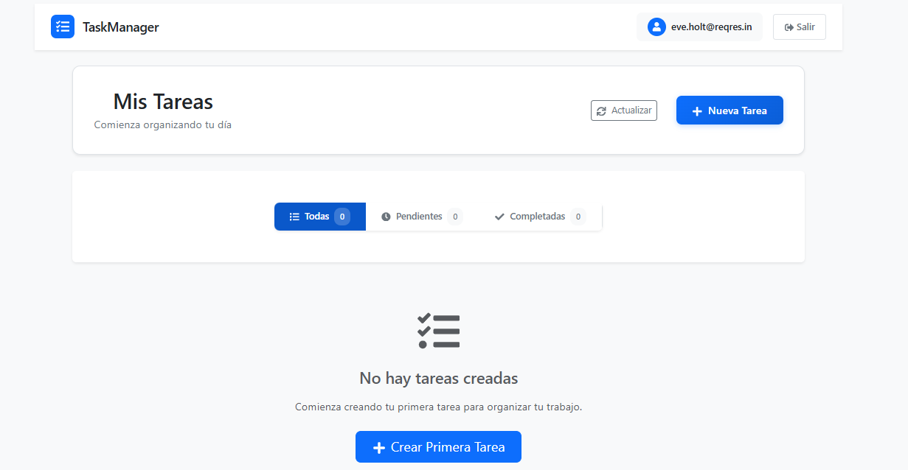
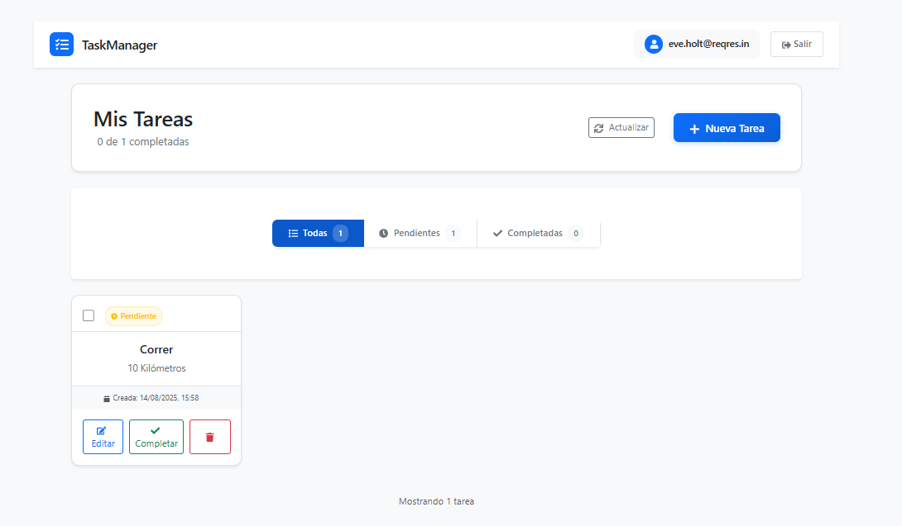
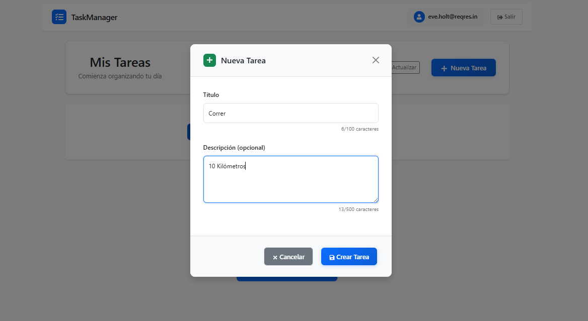
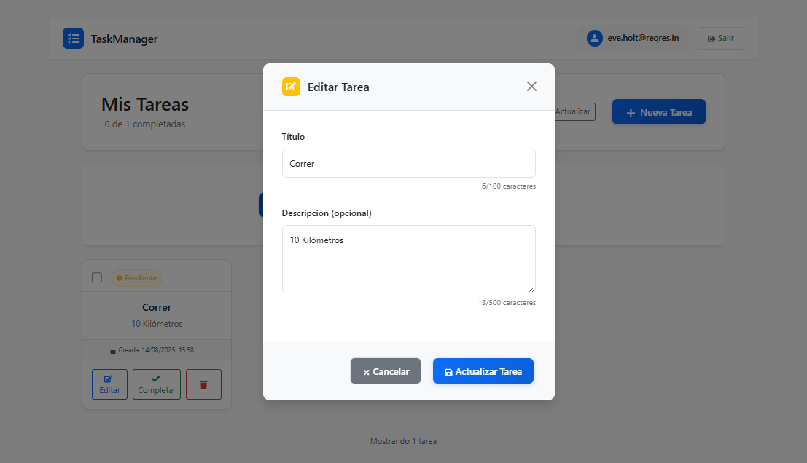
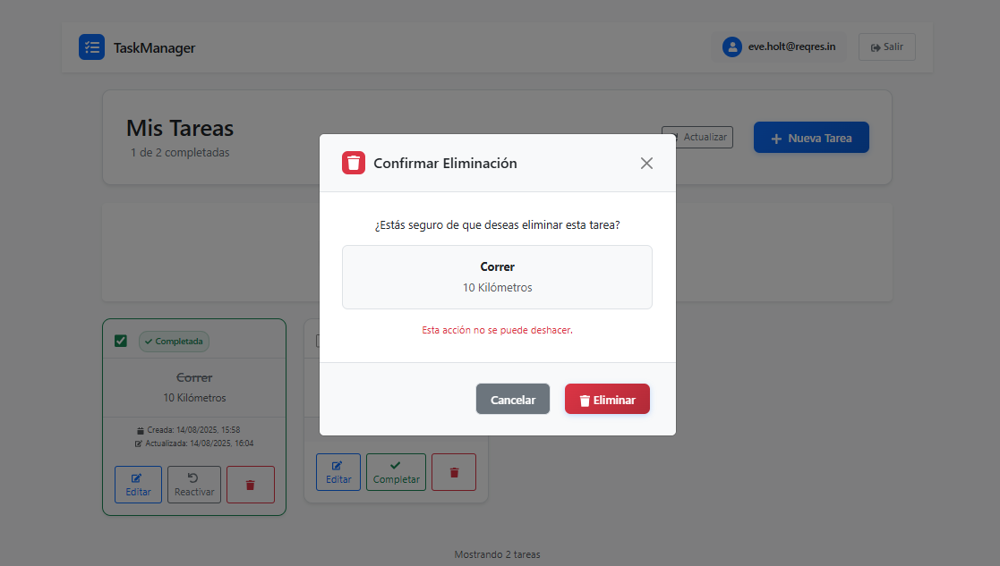

# Task Manager – Prueba Técnica

Aplicación web de gestión de tareas construida con React y Vite. Permite autenticación básica, listado/creación/edición/eliminación de tareas y filtrado por estado (todas, pendientes, completadas). Las tareas se consumen desde una API de MockAPI.

## Tecnologías

- React 19 + Vite 7
- React Router DOM
- Bootstrap 5 + React Bootstrap
- React Icons
- Fetch
- React Toastify

## Capturas de pantalla

## Enlace a la API (MockAPI)

Las tareas se obtienen desde la siguiente colección de MockAPI:

`https://689d460ace755fe697883774.mockapi.io/api/v1/Tarea`

 este endpoint se puede configuar en `src/utils/constants.js` (`API_URLS.TASKS`).

## Requisitos

- Node.js 18+ (recomendado)
- npm 9+

## Instrucciones para ejecutar el proyecto

Desde la carpeta raíz del proyecto (`task-manager`):

npm install && npm run dev

Luego abre `http://localhost:5173` en tu navegador.

## Scripts disponibles

- `npm run dev`: entorno de desarrollo
- `npm run build`: build de producción
- `npm run preview`: previsualizar el build localmente
- `npm run lint`: ejecutar ESLint

## Configuración relevante

- Endpoints y claves: `src/utils/constants.js`
- Servicio de autenticación: `src/services/authService.jsx`
- Servicio de tareas: `src/services/taskService.jsx`

## Estructura del proyecto

task-manager/
├── public/
│   └── vite.svg
├── src/
│   ├── components/
│   │   ├── auth/
│   │   │   ├── LoginForm.jsx
│   │   │   └── ProtectedRoute.jsx
│   │   ├── tasks/
│   │   │   ├── TaskList.jsx
│   │   │   ├── TaskItem.jsx
│   │   │   ├── TaskForm.jsx
│   │   │   └── TaskFilters.jsx
│   │   ├── layout/
│   │   │   ├── Header.jsx
│   │   │   └── Layout.jsx
│   │   └── common/
│   │       ├── LoadingSpinner.jsx
│   │       └── ErrorMessage.jsx
│   ├── contexts/
│   │   └── AuthContext.jsx
│   ├── hooks/
│   │   ├── useAuth.js
│   │   └── useTasks.js
│   ├── services/
│   │   ├── authService.js
│   │   └── taskService.js
│   ├── pages/
│   │   ├── LoginPage.jsx
│   │   ├── TasksPage.jsx
│   ├── utils/
│   │   └── constants.js
│   ├── assets/
│   │   └── react.svg
│   ├── App.css
│   ├── App.jsx
│   ├── index.css 
│   └── main.jsx 
├── .gitignore
├── index.html
├── package.json 
├── README.md
└── vite.config.js     

## Notas

- La autenticación utiliza `reqres.in` para simular login. Puedes probar con credenciales válidas de su documentación y teniendo en cuenta en la peticion el header y la api key de reqres.in.
